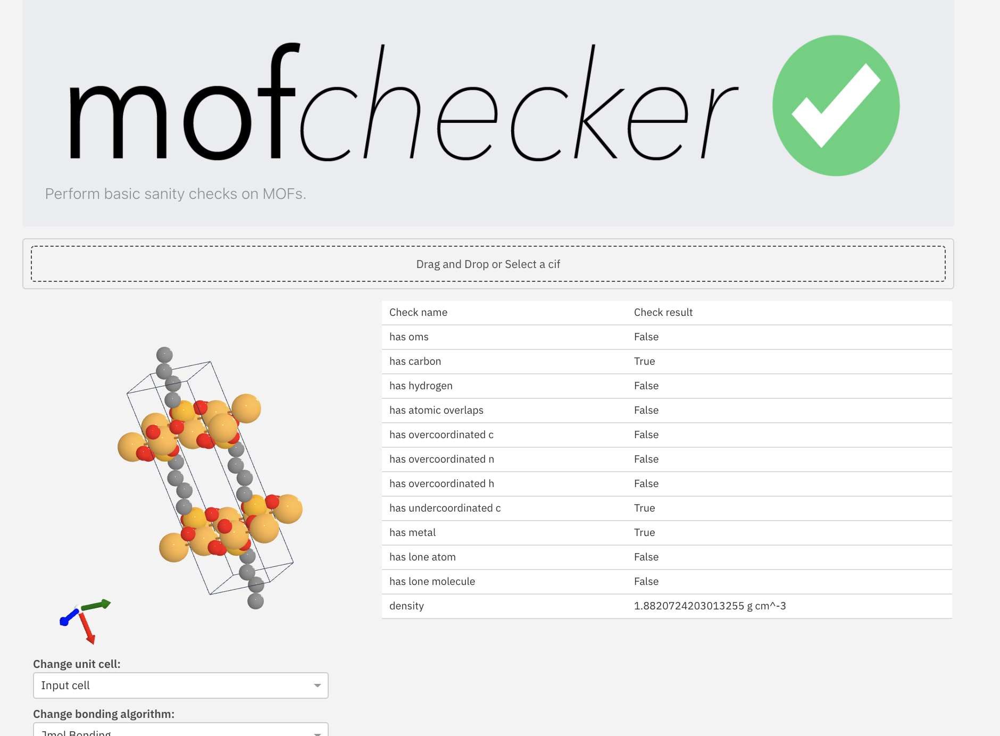

# webmofchecker

<p align="center">
 
</p>

Web interface for the [mofchecker package](https://github.com/kjappelbaum/mofchecker), currently deployed on [matcloud](https://mofchecker.matcloud.xyz/).

## Usage

### Docker

Build the Docker image using `./build_docker`. Then start the app using `./run_docker`.

### Frontend

A user interface with which a `cif` can be uploaded (using drag and drop) is served at `/`.

### API documentation

The API docs can be found at `/docs`.
A post to `/api/v1/checkMOF` with the content of `.example_request.json` should give output like

```json
{
  "checkResults": {
    "name": null,
    "path": null,
    "has_oms": true,
    "has_carbon": true,
    "has_hydrogen": true,
    "has_atomic_overlaps": false,
    "has_overcoordinated_c": false,
    "has_overcoordinated_n": false,
    "has_overcoordinated_h": false,
    "has_undercoordinated_c": false,
    "has_undercoordinated_n": false,
    "has_metal": true,
    "has_lone_atom": false,
    "has_lone_molecule": false,
    "density": 0.8701763810665458
  },
  "expectedResults": {
    "has_oms": false,
    "has_carbon": true,
    "has_hydrogen": true,
    "has_atomic_overlaps": false,
    "has_overcoordinated_c": false,
    "has_overcoordinated_n": false,
    "has_overcoordinated_h": false,
    "has_undercoordinated_c": false,
    "has_undercoordinated_n": false,
    "has_metal": true,
    "has_lone_atom": false,
    "has_lone_molecule": false
  },
  "checkDescriptions": {
    "has_oms": "Uses heuristics of order parameter to estimate if there is an uncordinated metal site",
    "has_carbon": "Checks if there is any carbon in the structure",
    "has_hydrogen": "Checks of there is any hydrogen in the structure",
    "has_atomic_overlaps": "Checks if there are atomic overlaps in the structure (estimated based on the adjacency matrix)",
    "has_overcoordinated_c": "Checks if there is any carbon number with coordination number > 4",
    "has_overcoordinated_n": "Checks if there is any nitrogen with coordination number > 4",
    "has_overcoordinated_h": "Checks if there is any carbon with coordination number > 1",
    "has_undercoordinated_c": "Checks with there is any carbon non-linear (i.e., sp2, sp3) carbon with less than two neighbors",
    "has_undercoordinated_n": "Checks if there is a nitrogen that likely misses a hydrogen (e.g., coordinated to a sp2, sp3 carbon)",
    "has_metal": "Checks if there is any metal in the structure",
    "has_lone_atom": "Checks if there is floating atom in the structure",
    "has_lone_molecule": "Checks if there is a floating atom or molecule in the structure"
  },
  "apiVersion": "v0.0.1"
}
```

## Acknowledgments

Frontend developed using the [crystaltoolkit](https://pypi.org/project/crystal-toolkit/) from the materialsproject.
